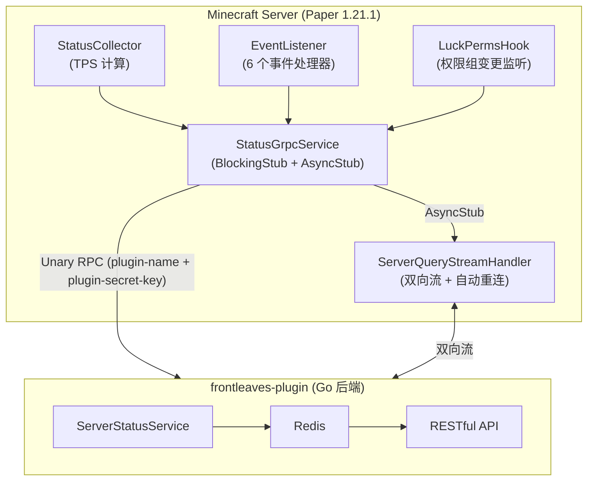

# Server-Status

FrontLeaves MC 服务器状态监控插件——通过 gRPC 将 Minecraft 服务器实时状态与玩家事件上报至 Go 后端，并支持双向流式查询通道。

## 架构



## 功能

- **服务器心跳**：定时上报在线玩家数、TPS
- **玩家事件**：加入（含权限组）、离开、切换世界、聊天、踢出、死亡
- **权限组变更监听**：通过 LuckPerms EventBus 监听权限组变更并上报
- **双向流式查询**：Go 后端可实时查询玩家状态、服务器状态、权限检查、权限组信息
- **认证机制**：通过 `plugin-name` + `plugin-secret-key` gRPC metadata 鉴权
- **空密钥保护**：未配置 `plugin-secret-key` 时拒绝启动
- **优雅降级**：LuckPerms 未安装时自动跳过权限相关功能

## 技术栈

| 类别 | 技术 |
|------|------|
| 语言 | Java 21 |
| 平台 | Paper API 1.21.1 |
| 构建 | Maven |
| 通信 | gRPC (Unary RPC + 双向流式 RPC) |
| Protobuf | 3.25.3 |
| gRPC 版本 | 1.62.2 |
| 权限 | LuckPerms API 5.5（软依赖） |
| 依赖库 | [frontleaves-lib](../frontleaves-lib) |

## 快速开始

### 环境要求

- JDK 21+
- Maven 3.8+
- [frontleaves-lib](../frontleaves-lib) 已安装到本地 Maven 仓库
- 运行中的 Go 后端 ([frontleaves-plugin](../../frontleaves-plugin))

### 构建

```bash
mvn clean package
```

构建产物位于 `target/server-status-1.0.0.jar`。

### 配置

将 JAR 放入服务器的 `plugins/` 目录，首次启动后编辑 `plugins/server-status/config.yml`：

```yaml
grpc:
  host: "localhost"           # Go 后端地址
  port: 50051                 # Go 后端 gRPC 端口
  server-name: "survival"     # 本服务器标识（集群内唯一）
  heartbeat-interval-seconds: 5  # 心跳上报间隔（秒）
auth:
  plugin-secret-key: ""       # 必填！从 Go 后端获取的密钥
```

> ⚠️ `plugin-secret-key` 为空时插件将拒绝启动。

## 目录结构

```
.
├── pom.xml                                          # Maven 构建（含 protobuf 插件）
├── src/main/
│   ├── proto/
│   │   ├── link/base.proto                          # BaseResponse 统一响应定义
│   │   └── status/v1/status.proto                   # ServerStatusService (9 RPC)
│   ├── java/.../serverStatus/
│   │   ├── ServerStatus.java                        # 主类：生命周期管理、组件初始化
│   │   ├── grpc/
│   │   │   ├── StatusGrpcService.java               # gRPC 客户端 (BlockingStub + AsyncStub)
│   │   │   └── ServerQueryStreamHandler.java        # 双向流处理器 (自动重连 + 指数退避)
│   │   ├── listener/EventListener.java              # Bukkit 事件监听 (6 事件)
│   │   ├── luckperms/LuckPermsHook.java             # LuckPerms EventBus 集成 + 权限组缓存
│   │   └── service/StatusCollector.java             # TPS 计算器 + 在线玩家数统计
│   └── resources/
│       ├── config.yml                               # 默认配置
│       └── paper-plugin.yml                         # Paper 插件描述
└── docs/superpowers/specs/                          # 协议说明文档
```

## RPC 列表

### Unary RPC (Java -> Go, BlockingStub)

| RPC | 方向 | Go 端状态 | 说明 |
|-----|------|-----------|------|
| `PlayerJoin` | Java -> Go | ✅ 已实现 | 玩家加入（含 groupName） |
| `PlayerQuit` | Java -> Go | ✅ 已实现 | 玩家离开 |
| `PlayerSwitchWorld` | Java -> Go | ✅ 已实现 | 切换世界 |
| `ServerHeartbeat` | Java -> Go | ✅ 已实现 | 心跳上报（在线玩家数 + TPS） |
| `PlayerChat` | Java -> Go | 🚧 待实现 | 聊天消息 |
| `PlayerKick` | Java -> Go | 🚧 待实现 | 被踢出 |
| `PlayerDeath` | Java -> Go | 🚧 待实现 | 死亡 |
| `PlayerGroupChange` | Java -> Go | ✅ 已实现 | 权限组变更（LuckPerms 触发） |

### 双向流式 RPC (AsyncStub)

| RPC | 方向 | Go 端状态 | 说明 |
|-----|------|-----------|------|
| `ServerQuery` | Go <-> Java | ✅ 已实现 | Go 发送查询请求，Java 处理并返回结果 |

#### ServerQuery 支持的查询事件

| 事件 | 编号 | 依赖 | 说明 |
|------|------|------|------|
| `QUERY_EVENT_GET_PLAYER_STATUS` | 1 | 无 | 查询玩家在线状态、所在服务器/世界 |
| `QUERY_EVENT_GET_SERVER_STATUS` | 2 | 无 | 查询在线玩家列表、TPS |
| `QUERY_EVENT_CHECK_PERMISSION` | 3 | LuckPerms | 检查玩家权限节点 |
| `QUERY_EVENT_GET_PLAYER_GROUPS` | 4 | LuckPerms | 获取玩家主权限组和所有权限组 |

## 相关项目

| 项目 | 说明 |
|------|------|
| [frontleaves-plugin](../../frontleaves-plugin) | Go 后端服务（gRPC Server + RESTful API） |
| [frontleaves-lib](../frontleaves-lib) | 共享库插件（gRPC 通道管理 + 认证拦截器） |

## 许可证

[MIT License](LICENSE)
